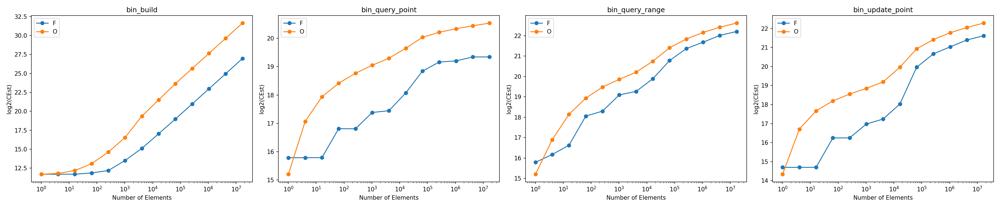
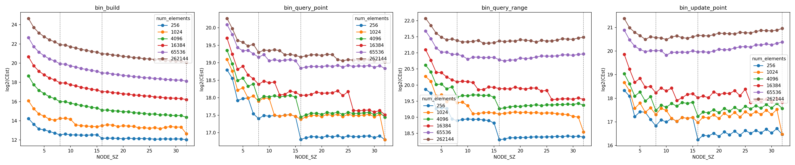

# Cache friendly segment tree

I attempt to implement an optimized segment tree for range sums.

The general interface for the segment tree implementations is found in [interface.rs](src/interface.rs):

```rust
pub trait SegTree {
    fn build(items: &[i64]) -> Self;

    fn query(&self, l: usize, r: usize) -> i64;

    fn update(&mut self, index: usize, val: i64);
}
```

There is a naive implementation, similar to what would be found on Wikipedia, in [oblivious.rs](src/obvlivious.rs). And in [friendly.rs](src/friendly.rs), is my optimized implementation.

## Optimization

I used two general ideas for optimization. First is to improve the efficiency of cache-line usage. Second is to reduce the number of function calls.

### Cache-line usage

Segment trees are generally stored as an array of nodes. The idea for optimization was how we can better design the locations of nodes to improve cache usage.

From a high level, all of the segment tree methods are depth-first traversals through its nodes, reducing its search range with the traversal. A typical cache-line is 64 bytes, or 8 `i64`s. In the oblivious implementation, a node stores one integer and its children are stored at indexes `2 * i + 1` and `2 * i + 2`. This means in the common case, in one cache-read of 8 nodes, we only get one integer of useful information. And with one integer we can reduce the search range to $1 / (1 + 1) = 1 / 2$. This means there are typically seven unused integers in the cache-line, quite inefficient!

The optimized version packs 8 integers into a single node, conveniently stored continguously in the array, and cache-aligned so that a single cache read will fetch an entire node. No wasted integers in the memory read, and we are able to reduce our search range to roughly $1 / (8 + 1) = 1 / 9$. Thus we are using far fewer memory reads than in the oblivious implementation, an improvement.

### Function calls

The segment tree methods are most naturally implemented recursively. This results in base-case checks that return very quickly from a function call, without doing much work. An example of this is seen in the `query_rec` function:

```rust
fn query_rec(&self, idx: usize, l: usize, r: usize, ql: usize, qr: usize) -> i64 {
    if ql > r || qr < l {
        // no overlap
        return 0;
    }
    // ...
}
```

The idea is that a function call has more overhead than the meaningful work we are getting out of it, so why not "inline" the recursive call in the parent call instead. This is the reasoning behind the rather complicated indexing math in `update_rec`:

```rust
// ...
let chunk_size = length / NODE_SZ;
let i = (pos - l) / chunk_size;
let next_start_idx = (start_idx + 1 + i) * NODE_SZ;
let next_l = l + i * chunk_size;
let next_r = next_l + chunk_size - 1;
self.update_rec(next_start_idx, next_l, next_r, pos, val);
self.nodes[start_idx + i] =
    slice_sum(&self.nodes[next_start_idx..next_start_idx + NODE_SZ]);
// ...
```

### Bonus: SIMD

We get a slight SIMD boost for free as a nature of packing more integers into a single node. To sum all the integers in a node, the `slice_sum` function is compiled to use SIMD add instruction instead.

However, due to the limitations of my benchmarking setup with cachegrind, I can't validate if this made much of a difference or not. This is because cachegrind executes SIMD instructions as a sequence of regular instructions.

## Benchmark results

Benchmarks were run with Valgrind and [Cachegrind](https://valgrind.org/docs/manual/cg-manual.html).

The metric used was Estimated Cycles (CEst), given by the following equation (weights configurable in the [the plotting script](tools/collect_bin_bench_data.py)):

```
1 * Ir + 14 * L1m + 17 * Bm + 294 * LLm
```

where
- `Ir` is the number of instructions,
- `Bm` is the number of branch misses,
- `L1m` is the number of L1 cache misses,
- `LLm` is the number of last layer cache misses (trips to main memory).

The weights are designed to mimic an [Intel Xeon Skylake processor](https://www.7-cpu.com/cpu/Skylake_X.html).

### General benchmarks

Four functions were benchmarked:
1. Building
2. Range query of various sizes
3. Point query at various points
4. Point update at various points

For range query, point query and point update, 1000 queries were ran. Node size was set to 16, as this was deemed optimal by the node size benchmark.



The optimized implementation (blue) is faster for large numbers of items across all functions.

### Node size benchmarks

In theory since eight items fit in a single cache line, node sizes that are a multiple of eight shuold be the most efficient. This benchmark confirms this. 



The gray vertical lines outline node sizes of 8, 16 and 32. And indeed we get a performance improvemat at each of those node sizes. Interestingly, this efficiency is less significant for a higher number of elements.

## AI disclosure

Ideas are my own. Implementation was done in part with Claude Code. This README was written by myself.
